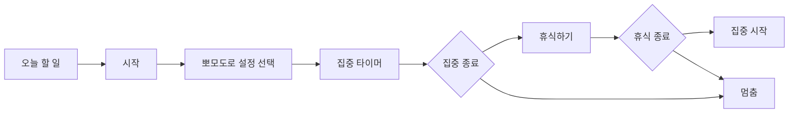

# 개인 실행 관리 앱 목표

## 제품 한 줄 정의

`잊지 마`는 습관을 기르고 오늘 해야 할 일을 실제 행동으로 옮기도록 돕는 개인 실행 관리 앱이다. 기본 동작은 캘린더 앱과 비슷하지만, 날짜보다 할 일 실행을 우선해서 보여주고 영어 단어 복습을 함께 제공한다.

## 핵심 목표

- 오늘 실제로 실행할 일과 자동으로 올라온 일정만 앞에 둔다.
- 계획을 많이 세우게 하기보다 지금 하나를 시작하게 만든다.
- 미룸을 실패가 아니라 재예약 신호로 기록한다.
- PC와 모바일에서 같은 계정으로 이어서 사용할 수 있게 한다.
- 할 일, 루틴, 연기/취소 기록, 알림, 영어 단어 복습을 하나의 흐름으로 묶는다.
- LLM 코딩 에이전트가 반복 실수 없이 개발할 수 있도록 스키마와 규칙을 먼저 고정한다.

## 제품 철학

- 예쁜 계획표보다 실제 착수를 우선한다.
- 선택지를 줄이고 기본값으로 굴러가게 한다.
- 매일 같은 루틴을 강요하지 않는다.
- 사용자를 혼내지 않는다.
- 오늘 화면이 앱의 중심이다.
- 완료 여부와 진행률은 자동 추정하지 않고 사용자에게 확인한다.

## 주요 사용자 흐름

## 주요 화면

| 화면 | 목적 | 핵심 요소 |
|---|---|---|
| 오늘 | 당장 실행할 일 표시 | 최대 15개, 루틴, 기간 일정, D-5 마감, 시작, 미루기, 취소 |
| 예정 | 미래/언젠가 할 일 저장소 | 날짜 있음, 마감 있음, 날짜 없음, 오늘로 가져오기, 진행률 |
| 월간 | 흐름 회고 | 완료, 미완료, 미룸 기록 |
| 단어 | 자동 영어 단어 복습 | 단어, 뜻 보기, 알겠음, 헷갈림, 모름 |
| 기록 | 패턴 확인 | 완료율, 미룸/연기 횟수, 취소 수, 외운 단어 수 |

## MVP 범위

1. 앱 목표/규칙/스키마 문서화
2. React + Firebase 구조 준비
3. Google 로그인
4. 초기 설정
5. 오늘 할 일
6. 고정 루틴
7. 예정/마감 할 일
8. 미룸/연기/취소/완료 기록
9. 선택형 뽀모도로 타이머
10. 단어 복습
11. 월간 캘린더
12. 기록/통계
13. PWA 설치/알림
14. PC/모바일 동기화 안정화

## 비목표

- 처음부터 복잡한 프로젝트 관리 앱을 만들지 않는다.
- 뽀모도로 실행 세션을 서버에 저장하지 않는다. 단, 마지막 사용 설정은 저장한다.
- 사용자가 직접 단어장을 입력하게 하지 않는다.
- 네이티브 알람 수준의 보장을 웹 MVP에서 약속하지 않는다. 앱이 열려 있거나 PWA/브라우저가 허용하는 백그라운드 범위에서 알림을 제공한다.
- 오늘 화면에 너무 많은 분류와 버튼을 넣지 않는다.
