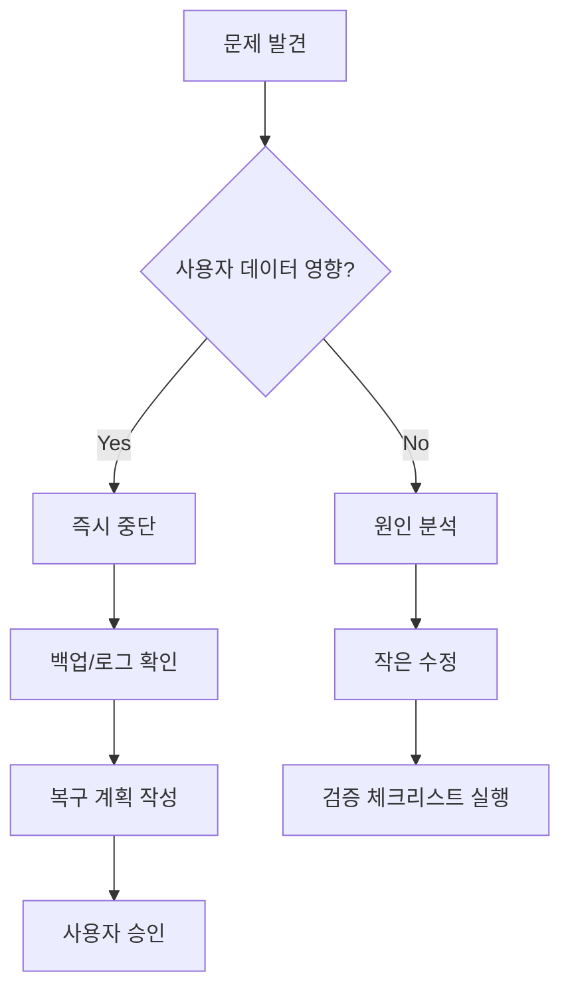

# 안전 규칙

## 데이터 안전

- 기존 사용자 데이터 삭제 금지.
- delete 기능은 MVP에서 신중하게 제한한다.
- 실제 삭제가 필요하면 soft delete를 우선한다.
- Firestore collection 구조 변경 시 마이그레이션 문서를 먼저 작성한다.
- 백업 없는 대량 변경 금지.

## 권한 안전

- Firebase security rules는 사용자별 경로 격리를 강제해야 한다.
- 클라이언트에서 다른 userId 경로에 접근할 수 없어야 한다.
- 관리자 기능은 MVP 범위에 포함하지 않는다.
- API key는 공개 가능한 Firebase client config 외에는 저장소에 커밋하지 않는다.

## 알림 안전

- 브라우저 알림 권한은 사용자 행동 이후 요청한다.
- 알림을 과도하게 보내지 않는다.
- 미룸 횟수가 늘어날수록 더 강하게 압박하지 않는다.
- 3회 초과 미루기 이후에는 연기 상태로 전환하고 같은 task를 같은 날 계속 괴롭히지 않는다.

## UX 안전

- 미룸, 연기, 미완료를 실패로 표현하지 않는다.
- 사용자의 행동을 비난하는 문구를 쓰지 않는다.
- 선택지를 늘려 불안을 키우지 않는다.
- 오늘 화면에서 실행보다 관리가 앞서지 않게 한다.

## 개발 안전

- 스키마 변경은 `/harness/data-schema.md`와 migration 문서를 함께 수정한다.
- 제품 규칙 변경은 `/harness/product-rules.md`를 먼저 수정한다.
- 큰 리팩터링과 기능 추가를 한 커밋에 섞지 않는다.
- service worker 변경 후 캐시 버전을 확인한다.
- 배포 전 검증 체크리스트를 확인한다.

## Firebase 보안 규칙 초안

```js
rules_version = '2';

service cloud.firestore {
  match /databases/{database}/documents {
    match /users/{userId}/{document=**} {
      allow read, write: if request.auth != null && request.auth.uid == userId;
    }
  }
}
```

## 위험 작업 승인 기준

| 작업 | 승인 필요 |
|---|---|
| 사용자 데이터 삭제 | 항상 필요 |
| 스키마 필드 제거 | 항상 필요 |
| Firestore rules 완화 | 항상 필요 |
| production 배포 | 필요 |
| dependency 대규모 변경 | 필요 |
| UI 문구 단순 변경 | 불필요 |

## 실패 시 복구 원칙


